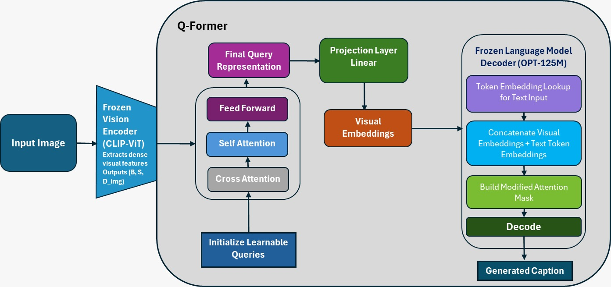
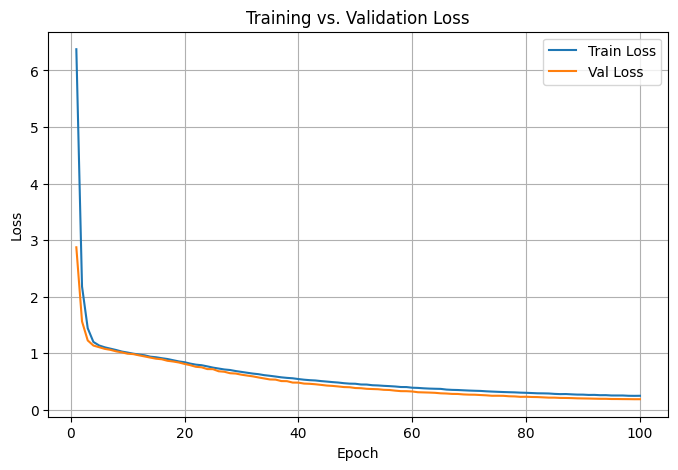
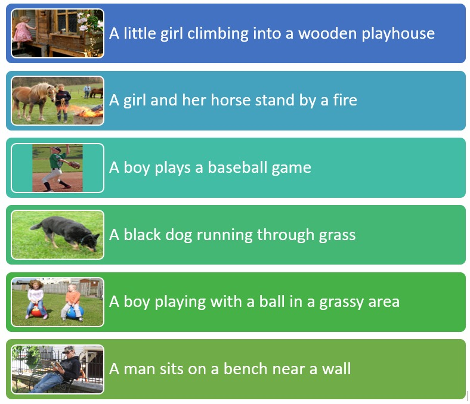
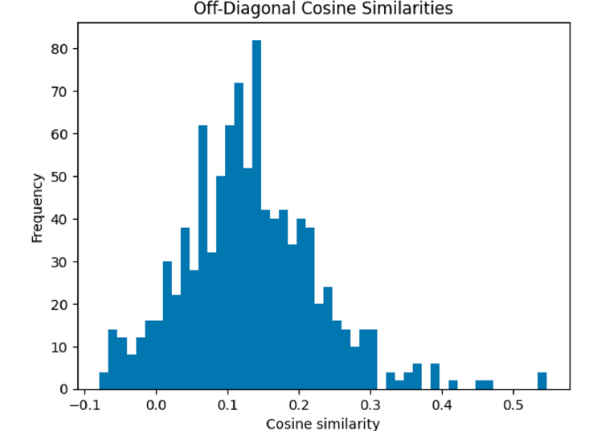

# 🖼️📜 Vision-Language Captioning with ViT & LLM (BLIP-2 Inspired)

**Deep Learning Project – Image Caption Generation using Frozen ViT and LLM**

---

## 🧠 Overview

This project implements a transformer-based image captioning system that bridges visual and language domains. It uses:
- A **frozen Vision Transformer (CLIP-ViT-B/32)** as the visual encoder
- A **frozen Language Model (OPT-125M)** as the decoder
- A **trainable Q-Former** to link vision and language spaces

The architecture is inspired by **BLIP-2**, enabling efficient multimodal learning with minimal training from scratch.

---

## 🎯 Motivation

Automatic image captioning has wide-reaching real-world applications:
- Supporting the visually impaired
- Enhancing visual search
- Improving HCI with multimodal agents
- Enabling content moderation and description

This project showcases the strength of transformer-based pre-trained models in a low-resource setting using transfer learning.

---

## 🏗️ Architecture

```
Image → CLIP-ViT Encoder → Q-Former → OPT Decoder → Caption
```

- **ViT (Frozen)**: Extracts image features
- **Q-Former (Trainable)**: Transforms features into language-consumable tokens
- **OPT-125M (Frozen)**: Generates captions

<p align="center">
  
</p>

---

## 📂 Dataset

We used the **Flickr8K dataset**, containing:
- ~8,000 images
- 5 human-written captions per image

> Download instructions and license information available via [Flickr8k Dataset Request Page](https://forms.illinois.edu/sec/1713398).

---

## ⚙️ Training Details

| Component      | Description                       |
|----------------|-----------------------------------|
| Vision Encoder | CLIP ViT-B/32 (frozen)            |
| Decoder        | OPT-125M (frozen)                 |
| Bridge Module  | 32-learnable Q-Former queries     |
| Layers         | 4 Q-Former layers (cross/self attention) |
| Loss           | Cross Entropy (masked for visual tokens) |
| Optimizer      | AdamW                             |

---

## 🧪 Inference Strategy

Used a hybrid of:
- **Beam Search** (`num_beams=3`)
- **Nucleus Sampling** (`top-p=0.8`)

This ensures a good balance between diversity and coherence.

---

## 📊 Evaluation Metrics

| Metric       | Score   | Description                                    |
|--------------|---------|------------------------------------------------|
| BLEU-1       | 0.6383  | Word-level match                              |
| BLEU-4       | 0.1837  | Phrase-level coherence                        |
| METEOR       | 0.3027  | Stemming + synonym-aware similarity           |
| ROUGE-L      | 0.3424  | Longest common subsequence                    |
| CIDEr        | 0.4935  | Consensus relevance with references           |
| SPICE        | 0.1541  | Scene graph-based semantic similarity         |
| BERTScore-F1 | 0.6463  | Sentence-level semantic match (transformer)   |
| CLIPScore    | 0.2872  | Visual-text alignment using CLIP embeddings   |

---

## 📈 Training & Validation Curves

<p align="center">
  
</p>

No overfitting observed. Validation loss trends close to training loss.

---

## 🖼️ Generated Captions (Qualitative Results)

<p align="center">
  
</p>

Captions are fluent, contextually relevant, and diverse. The model captures key objects and activities.

---

## 🔍 Diversity of Q-Former Queries

Cosine similarity heatmap among 32 Q-Former queries shows low inter-query similarity — indicating query specialization and rich information extraction.

<p align="center">
  
</p>

---

## 🛠️ How to Run

### 1. Clone and Setup

```bash
git clone https://github.com/yourusername/image-captioning-blip2.git
cd image-captioning-blip2
```

### 2. Install Requirements

```bash
pip install torch transformers datasets accelerate matplotlib
```

### 3. Run Notebook

Launch `caption_generation.ipynb` using Jupyter Notebook or Colab.

> Update paths for dataset and model if needed.

---

## 📌 File Structure

```
📁 image-captioning-blip2/
├── caption_generation.ipynb        # Main implementation
├── images/                         # Generated visuals and plots
│   ├── model_architecture.png
│   ├── loss_curve.png
│   ├── generated_caption_1.png
│   ├── qformer_similarity.png
├── README.md
```

---

## 🚧 Limitations and Future Work

- LLM decoder size (OPT-125M) limits semantic depth; larger models may improve performance
- Q-Former depth can be extended for better query refinement
- Future work: explore zero-shot transfer, caption grounding, and multi-turn dialogue tasks

---

## 📚 References

- [BLIP-2 Paper (Junnan Li et al., 2023)](https://arxiv.org/abs/2301.12597)
- [Show, Attend and Tell (Xu et al., 2015)](https://arxiv.org/abs/1502.03044)
- [Flickr8k Dataset (UIUC)](https://forms.illinois.edu/sec/1713398)
- [Attention is All You Need (Vaswani et al., 2017)](https://arxiv.org/abs/1706.03762)
